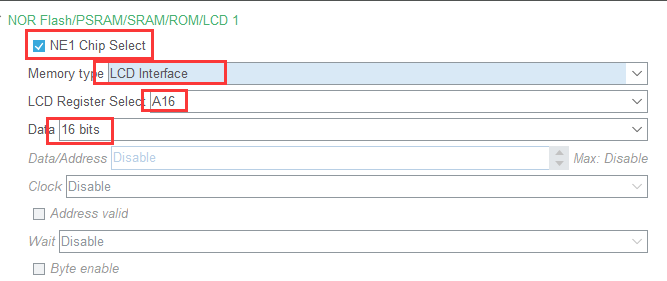

# il9341 FSMC

使用fsmc驱动 il9341

> 要点:
> 1. 计算命令地址
> 2. 计算数据地址
> 
cubemx 配置:



RTT配置:

1. 注意使用新版的hal库驱动, 默认的rtt驱动中没有fsmc.h源文件和头文件


2. 在 `rtconfig.h`中配置FSMC宏

```c
#define BSP_USING_EXT_SRAM
```
计算地址命令地址:

根据配置的`NE_x`来确定地址

为啥要左移一位(8bits无需左移)的解释:https://www.bilibili.com/video/BV1bv4y1R7dp?t=2534.3&p=118

```c
#define NEx  1     // ne1
#define PAx  16    // PA16
#define LCD_REG (uint32_t)(0x6000 0000 +(0x400 0000)*(NEx-1))
/* 为啥要左移一位: 16bit的数据需要左移一位, 数据为8bit的时候无需左移 因为地址线pa0没有使用所以有了一位的偏移*/
#define LCD_DATA (uint32_t)(LCD_REG|(2^PAx<<1))
```


