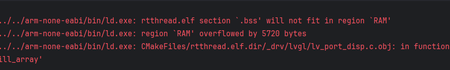
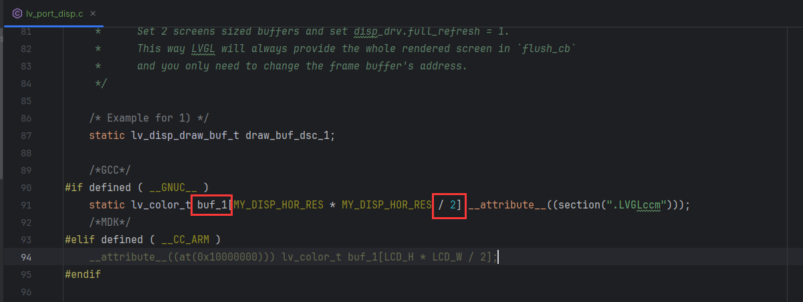
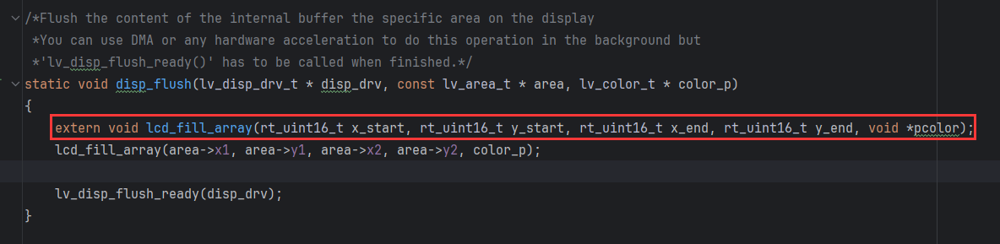

# 移植要点

> 1. 通常会报错内存不够，通常是默认buffer开的太大。



#### 解决方案： 
修改刷新buf的大小
修改这个`buf_1`的大小, 这个表示每次刷新多少数据, 默认刷新一半,一半不够就刷新1/4 1/8 ...



> 2. 默认的语法可能存在报错编译器无法通过

lv_demo.c

```c
/* 因为这个外部函数没有返回类型所以不对 */
// extern lv_demo_calendar(); 
void extern lv_demo_calendar();
lv_demo_calendar();
```

> 3. `lcd_fill_array`函数没有定义

lvgl/lv_port_disp.c:161: undefined reference to `lcd_fill_array'



这也是一个外部函数, 需要在外部定义

